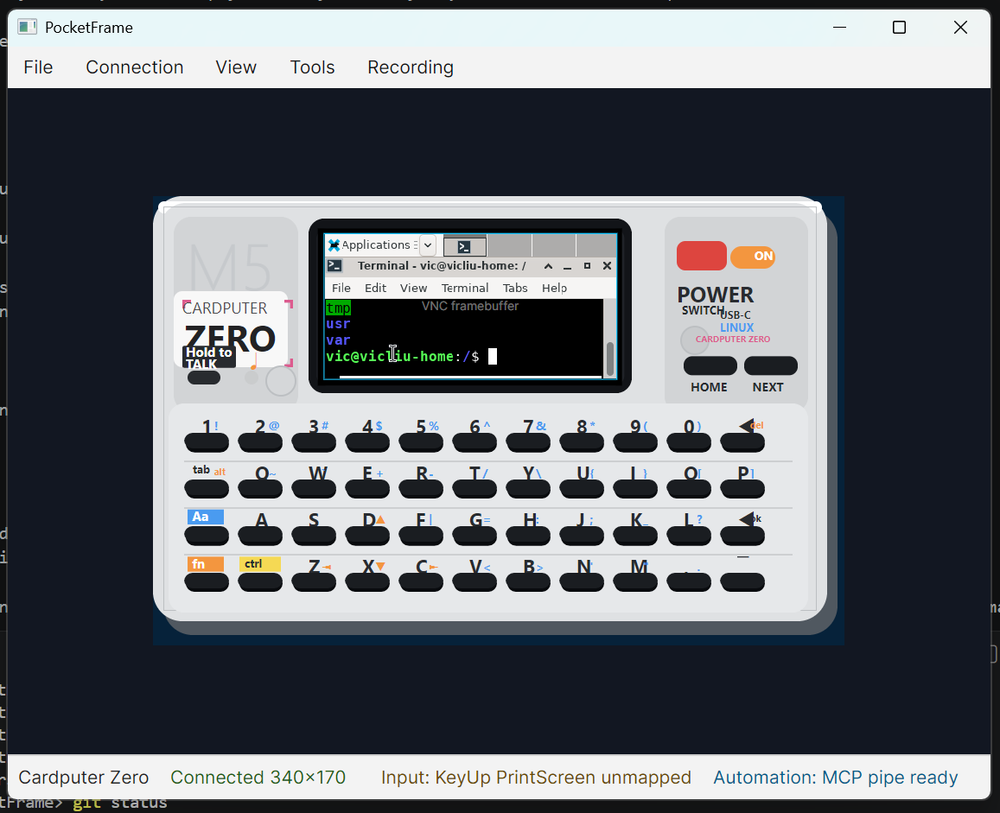

# PocketFrame

PocketFrame is an MCP-controllable device-shell simulator for pocket-sized Linux computers.

PocketFrame lets an AI agent, developer, or tester interact with a real remote Linux graphical session as if it were running inside a specific handheld device shell. It combines:



- an Avalonia-rendered device body;
- a fixed-size screen viewport;
- a native RFB/VNC framebuffer client;
- device-aware keyboard, pointer, and virtual button mapping;
- screen and device capture;
- an MCP-only automation path for AI-driven debugging.

## Why PocketFrame Exists

Small Linux devices often use unusual screen sizes such as `340x170`, `720x720`, or `1280x720`. A normal desktop window does not show whether an app feels usable on a tiny screen, inside a physical keyboard layout, or behind a device-specific interaction model.

PocketFrame focuses on the whole-device usage context:

- the application is real;
- the Linux session is real;
- the screen size is constrained;
- the shell, buttons, and keyboard layers are device-specific;
- AI agents can observe the framebuffer and perform structured actions through MCP.

The current built-in profiles include:

- Cardputer Zero with a `340x170` screen;
- uConsole with a `1280x720` screen.

## What PocketFrame Is Not

PocketFrame is not a virtual machine and does not emulate hardware. It does not simulate:

- CPU or GPU behavior;
- GPIO, I2C, SPI, or other buses;
- Raspberry Pi / CM hardware;
- storage, firmware, boot, or board-level behavior;
- QEMU, VirtualBox, or container lifecycle management.

PocketFrame expects an existing Linux graphical session exposed over VNC, then places that session inside a device shell and gives humans or AI agents device-level controls.

## Architecture

```text
PocketFrame.App
  - Avalonia GUI
  - Device shell renderer
  - Native RFB/VNC client
  - Input mapping
  - Capture services
  - Automation pipe server

PocketFrame.Mcp
  - MCP stdio server
    -> internal named pipe
    -> PocketFrame.App AutomationService

PocketFrame.Automation
  - Shared command, response, pipe, and result models
```

MCP is the AI-facing entry point. The MCP server does not own the VNC session or the UI. It forwards structured commands to the running PocketFrame app through an internal named pipe. PocketFrame intentionally does not expose an HTTP automation API or CLI at this stage.

## Why Avalonia + Native VNC

PocketFrame uses Avalonia Desktop for native UI and a native RFB/VNC client for framebuffer display and input forwarding.

The MVP intentionally avoids:

- WebView;
- noVNC;
- Electron;
- browser-embedded VNC;
- web-app architecture.

This keeps the simulator desktop-native and preserves a clean boundary between UI, VNC transport, device profiles, input mapping, capture, and automation.

## Prerequisites

- .NET SDK 9.0 or newer
- A reachable VNC server
- A Linux graphical session sized for the target device

## Run the App

```bash
dotnet restore
dotnet run --project src/PocketFrame.App/PocketFrame.App.csproj
```

The app starts the internal automation pipe server automatically. The status bar shows `Automation: MCP pipe ready` when the pipe is available.

## MCP Startup Model

`PocketFrame.App` automatically starts the internal automation pipe server. The MCP stdio process is normally launched by the MCP host, because stdio MCP requires the client process to own stdin/stdout.

PocketFrame release packages include both:

- `PocketFrame.App`, the GUI simulator;
- `PocketFrame.Mcp`, the MCP stdio server.

Configure your AI client to launch `PocketFrame.Mcp` after starting `PocketFrame.App`.

## Start a VNC Test Session

On a Linux VM, WSL distro, or device:

```bash
sudo apt install tigervnc-standalone-server openbox xterm
vncserver :10 -geometry 340x170 -depth 24
```

For uConsole:

```bash
vncserver :11 -geometry 1280x720 -depth 24
```

Example `~/.vnc/xstartup`:

```sh
#!/bin/sh
openbox &
xterm
```

PocketFrame connection settings:

- Cardputer Zero: port `5910` for display `:10`
- uConsole: port `5911` for display `:11`
- host: VM, WSL, device, or localhost address
- password: the VNC password, if configured

## Connect from the GUI

1. Launch `PocketFrame.App`.
2. Open `Connection -> Connect...`.
3. Choose or edit a saved connection.
4. Connect to the VNC server.
5. The remote framebuffer appears inside the selected device shell.

## MCP Automation

Start the GUI first, then configure your MCP client to launch:

```bash
dotnet run --project src/PocketFrame.Mcp/PocketFrame.Mcp.csproj
```

Example MCP client configuration:

```json
{
  "mcpServers": {
    "pocketframe": {
      "command": "dotnet",
      "args": [
        "run",
        "--project",
        "C:/Users/VicLi/Documents/Projects/PocketFrame/src/PocketFrame.Mcp/PocketFrame.Mcp.csproj"
      ]
    }
  }
}
```

Available MCP tools:

- `pocketframe_get_state`
- `pocketframe_capture_screen`
- `pocketframe_capture_device`
- `pocketframe_type_text`
- `pocketframe_press_key`
- `pocketframe_press_button`
- `pocketframe_click_screen`
- `pocketframe_wait_frame_change`

See `docs/mcp-automation.md` for schemas, examples, coordinate rules, and troubleshooting.

## Automation Inspector

Open:

```text
Tools -> Automation Inspector
```

The inspector shows:

- automation pipe status;
- pipe name;
- selected device;
- VNC status;
- frame index;
- last framebuffer update time;
- last automation command;
- last result or error;
- log file location;
- the MCP server launch command.

It is a human debugging panel for the MCP bridge. It does not execute tools.

## Coordinate System

Automation commands use device-level coordinates:

- `pocketframe_click_screen` uses VNC framebuffer coordinates.
- Cardputer Zero screen coordinates are `340x170`.
- uConsole screen coordinates are `1280x720`.
- Host window position and OS display scaling are ignored by automation tools.

The GUI still supports visual scaling for humans, but automation operates on stable device coordinates.

## Pixel Scale

PocketFrame treats `1x` as physical-pixel scale. On desktops configured to 125%, 150%, or 200% display scaling, the simulator compensates for the OS render scale so a Cardputer Zero `340x170` screen occupies approximately `340x170` physical monitor pixels.

## Device Profiles

Device profiles live under:

```text
src/PocketFrame.App/Assets/Devices/<device-id>/
```

A profile folder contains:

- `profile.json`
- `shell.svg`
- optional `preview.png`

The profile defines:

- shell size;
- screen size;
- screen position;
- button geometry;
- key mapping.

See `docs/device-profile.md`.

## Technical Direction

PocketFrame is evolving toward MCP-first AI automation, richer frame observation, and high-level external device module simulation. Planned module examples include virtual GPS, virtual LoRa, virtual serial sensors, battery state, and network state.

See `docs/technical-direction.md` for the detailed technical route and evolution plan.

## Changelog

See `CHANGELOG.md` for release notes.

## Current Limits

- The RFB client is intentionally minimal.
- Raw encoding is supported; Tight, Hextile, and CopyRect are deferred.
- MCP automation currently controls the running GUI app through a local named pipe.
- The MCP server expects `PocketFrame.App` to already be running.
- `capture_screen` is framebuffer-based; `capture_device` captures the rendered Avalonia device view.
- Recording remains a placeholder service.
- Device shells are still approximate and can be refined.

## Roadmap

- Improve RFB performance and add more encodings.
- Expand MCP automation with richer frame observation and stable-wait tools.
- Add an MCP-friendly action trace and replay log.
- Add high-level external module simulation such as virtual GPS and virtual LoRa.
- Add more device profiles such as T-Deck and additional cyberdeck layouts.
- Refine shell artwork and keyboard legends.
- Implement recording through frame capture or ffmpeg.
